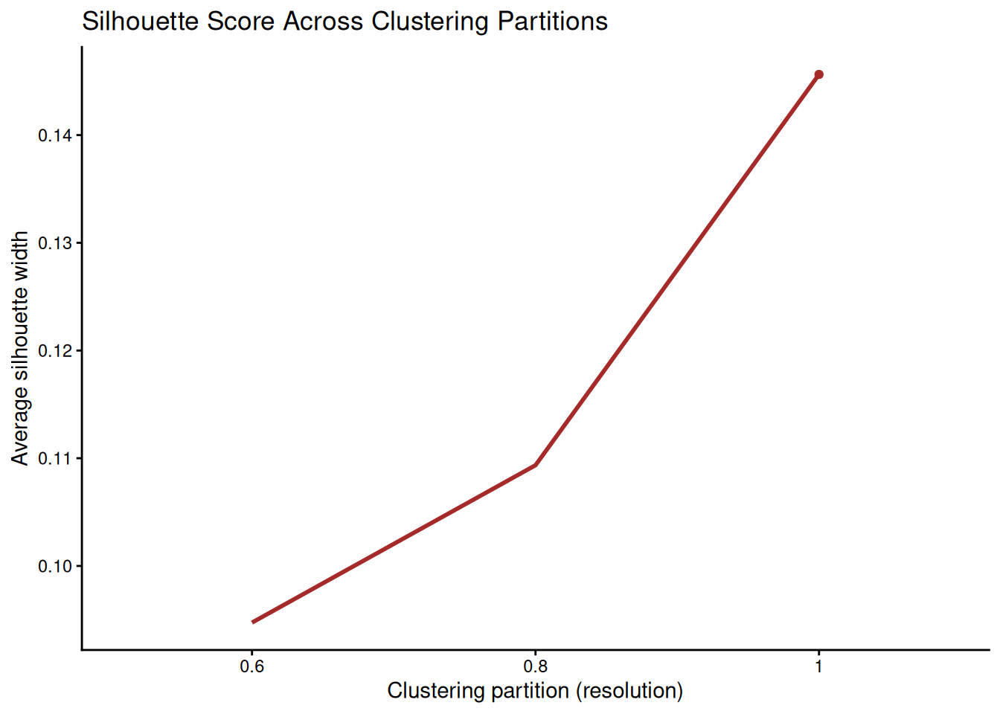
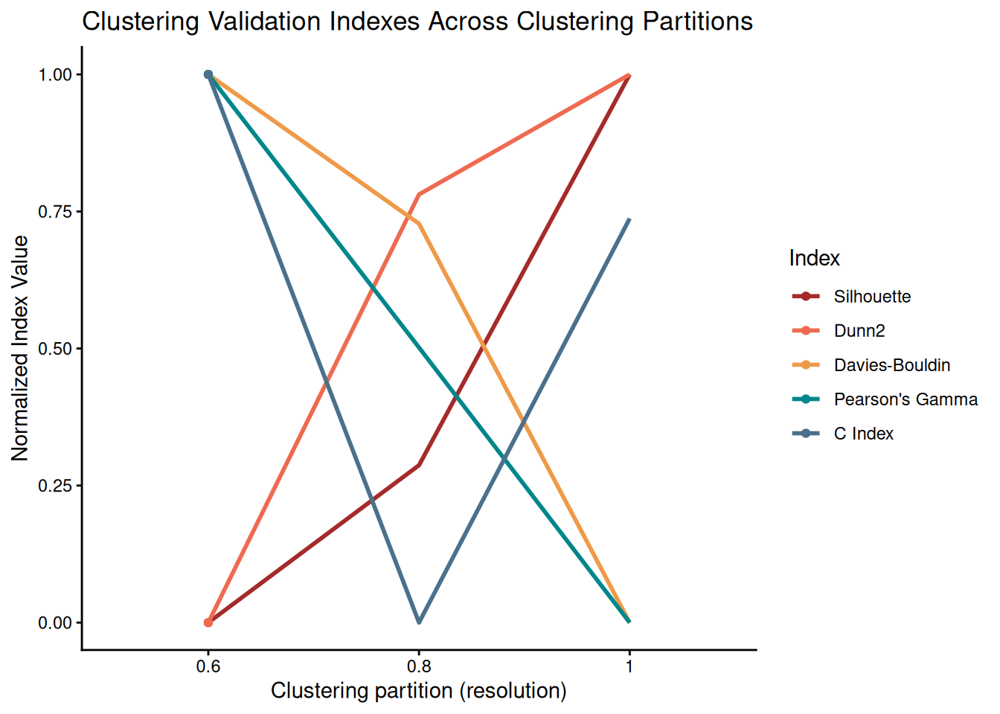

# Introduction to muscadet

`muscadet` (**mu**ltiomics **s**ingle-cell **c**opy number
**a**lterations **det**ection) is an R package for identifying copy
number alterations (CNAs) in cancer cells from single-cell multiomics
data.

## 1 Installation

Install the latest version directly from GitHub.

``` r
library(devtools)
devtools::install_github("ICAGEN/muscadet")
```

## 2 Inputs and objects creation

### 2.1 muscomic

The `muscomic` objects (see
[`?muscomic`](https://icagen.github.io/muscadet/reference/muscomic-class.md))
are primary objects for the muscadet analysis, created using the
[`CreateMuscomicObject()`](https://icagen.github.io/muscadet/reference/CreateMuscomicObject.md)
function with the following inputs:

- `type`: a type of omic, `"RNA"` and `"ATAC"` being the ones currently
  supported. Note that for other DNA types omics, the `"ATAC"` type can
  be used.
- `mat_counts`: a raw count matrix (see
  [`?mat_counts`](https://icagen.github.io/muscadet/reference/mat_counts.md)).
- `allele_counts`: a table of raw counts per allele (see
  [`?allele_counts`](https://icagen.github.io/muscadet/reference/allele_counts.md))
  *(optional, can be added later during analysis)*.
- `features`: a table of features coordinates (see
  [`?features`](https://icagen.github.io/muscadet/reference/features.md)).

``` r
library(muscadet)

# Load example dataset inputs:
# Matrices of raw counts per features
data("mat_counts_atac_tumor", "mat_counts_rna_tumor")
# Table of raw counts per allele
data("allele_counts_atac_tumor", "allele_counts_rna_tumor")
# Table of feature coordinates
data("peaks", "genes")

# Create individual omic objects
atac <- CreateMuscomicObject(
    type = "ATAC",
    mat_counts = mat_counts_atac_tumor, 
    allele_counts = allele_counts_atac_tumor, 
    features = peaks)
rna <- CreateMuscomicObject(
    type = "RNA",
    mat_counts = mat_counts_rna_tumor,
    allele_counts = allele_counts_rna_tumor,
    features = genes)

atac
#> A muscomic object of type ATAC labelled scATAC-seq containing: 
#>  mat.counts coverage data matrix 
#>  112 cells 
#>  1000 features: peaks 
#>  691 variant positions

rna
#> A muscomic object of type RNA labelled scRNA-seq containing: 
#>  mat.counts coverage data matrix 
#>  119 cells 
#>  500 features: genes 
#>  373 variant positions
```

### 2.2 muscadet

The `muscadet` objects (see
[`?muscadet`](https://icagen.github.io/muscadet/reference/muscadet-class.md))
consists of one or several `muscomic` objects, along with additional
information and it will store downstream analysis results. They can be
created using the
[`CreateMuscadetObject()`](https://icagen.github.io/muscadet/reference/CreateMuscadetObject.md)
function with a list of `muscomic` objects as input as well as bulk
coverage information (see
[`?bulk_lrr`](https://icagen.github.io/muscadet/reference/bulk_lrr.md))
and the genome assembly to use.

``` r
# Table of coverage information (log ratio) from bulk data (i.e. WGS)
data("bulk_lrr")

# Create multiomic muscadet object
muscadet <- CreateMuscadetObject(
    omics = list(ATAC = atac, RNA = rna),
    bulk.lrr = bulk_lrr,
    bulk.label = "WGS",
    genome = "hg38")
muscadet
#> A muscadet object 
#>  2 omics: ATAC, RNA 
#>  types: ATAC, RNA 
#>  labels: scATAC-seq, scRNA-seq 
#>  coverage data matrix: mat.counts, mat.counts 
#>  cells: 112, 119 (common: 84, total: 147) 
#>  features: 1000, 500 
#>  feature labels: peaks, genes 
#>  variant positions: 691, 373 
#>  data from paired bulk sequencing: WGS 
#>  clustering: None 
#>  CNA calling: None 
#>  genome: hg38
```

An example of a complete `muscadet` object with a demo dataset is
included in the package.

``` r
# Example muscadet object
data("muscadet_obj")
muscadet_obj
#> A muscadet object 
#>  2 omics: ATAC, RNA 
#>  types: ATAC, RNA 
#>  labels: scATAC-seq, scRNA-seq 
#>  coverage data matrix: log.ratio, log.ratio 
#>  cells: 112, 119 (common: 84, total: 147) 
#>  features: 133, 349 
#>  feature labels: windows of peaks, genes 
#>  variant positions: 691, 373 
#>  data from paired bulk sequencing: WGS 
#>  clustering: partitions = 0.6, 0.8, 1 ; optimal partition = 1 
#>  CNA calling: 2 clusters ; 47 consensus segments including 1 CNA segments 
#>  genome: hg38
```

Create another `muscadet` object with reference cells data.

``` r
data("mat_counts_atac_ref", "mat_counts_rna_ref")
data("allele_counts_atac_ref", "allele_counts_rna_ref")

atac_ref <- CreateMuscomicObject(
    type = "ATAC",
    mat_counts = mat_counts_atac_ref,
    allele_counts = allele_counts_atac_ref,
    features = peaks)
rna_ref <- CreateMuscomicObject(
    type = "RNA",
    mat_counts = mat_counts_rna_ref,
    allele_counts = allele_counts_rna_ref,
    features = genes)
muscadet_ref <- CreateMuscadetObject(
    omics = list(ATAC = atac_ref, RNA = rna_ref),
    genome = "hg38")
muscadet_ref
#> A muscadet object 
#>  2 omics: ATAC, RNA 
#>  types: ATAC, RNA 
#>  labels: scATAC-seq, scRNA-seq 
#>  coverage data matrix: mat.counts, mat.counts 
#>  cells: 99, 97 (common: 78, total: 118) 
#>  features: 1000, 500 
#>  feature labels: peaks, genes 
#>  variant positions: 691, 373 
#>  data from paired bulk sequencing: None 
#>  clustering: None 
#>  CNA calling: None 
#>  genome: hg38
```

### 2.3 Methods

Several method functions are available to access data within
`muscadet`/`muscomic` objects.

``` r
library(SeuratObject) # Cells() and Features() methods imported from SeuratObject

# Cell names
Cells(muscadet_obj) # list of cells, one element per omic
Cells(muscadet_obj)$ATAC # element of the list
Cells(muscadet_obj$ATAC) # cells for muscomic object
Reduce(union, Cells(muscadet_obj)) # all cells
Reduce(intersect, Cells(muscadet_obj)) # common cells

# Feature names
Features(muscadet_obj) # list, one element per omic
Features(muscadet_obj)$ATAC

# Matrix of raw counts
matCounts(muscadet_obj) # list, one element per omic
matCounts(muscadet_obj$ATAC)

# Matrix of log ratios
matLogRatio(muscadet_obj) # list, one element per omic
matLogRatio(muscadet_obj)$ATAC

# Table of feature coordinates
coordFeatures(muscadet_obj) # list, one element per omic
coordFeatures(muscadet_obj)$RNA
```

``` r
library(SeuratObject) # Cells() and Features() methods imported from SeuratObject

# number of cells in total
length(Reduce(union, Cells(muscadet_obj)))
#> [1] 147
# number of common cells
length(Reduce(intersect, Cells(muscadet_obj)))
#> [1] 84
# number of cells per omic
lapply(Cells(muscadet_obj), length)
#> $ATAC
#> [1] 112
#> 
#> $RNA
#> [1] 119
# number of features per omic
lapply(Features(muscadet_obj), length)
#> $ATAC
#> [1] 133
#> 
#> $RNA
#> [1] 349
```

## 3 Compute log ratios

Compute genome-wide coverage profiles as log ratio (LRR) matrices with
[`computeLogRatio()`](https://icagen.github.io/muscadet/reference/computeLogRatio.md)
for every omic present in the muscadet object.

``` r
# Compute log R ratios from scATAC-seq read counts
muscadet <- computeLogRatio(
    x = muscadet,
    reference = muscadet_ref,
    omic = "ATAC",
    method = "ATAC",
    minReads = 1, # low value for small example dataset
    minPeaks = 1) # low value for small example dataset

# Compute log R ratios from scRNA-seq read counts
muscadet <- computeLogRatio(
    x = muscadet,
    reference = muscadet_ref,
    omic = "RNA",
    method = "RNA",
    refReads = 2, # low value for small example dataset
    refMeanReads = 0.01) 
```

To adjust filters applied to features by
[`computeLogRatio()`](https://icagen.github.io/muscadet/reference/computeLogRatio.md),
you can check distribution of data and filter status of features.

``` r
ATAC_features <- coordFeatures(muscadet_obj)$ATAC

ggplot(ATAC_features, aes(x = nPeaks, y = meanReads.ref, color = keep)) +
    geom_point() +
    geom_vline(xintercept = 1 , linetype = "dashed", color = "red") + # minPeaks threshold
    geom_hline(yintercept = 1, linetype = "dashed", color = "red") + # minReads threshold
    scale_y_log10() +
    labs(x = "Number of peaks (minPeaks)", y = "Mean of reads in reference cells (minReads)",
         title = "ATAC features (windows of peaks) filtered by thresholds") +
    theme_minimal()
#> Warning in scale_y_log10(): log-10 transformation introduced infinite values.
#> Warning: Removed 197 rows containing missing values or values outside the scale range
#> (`geom_point()`).
```


``` r

RNA_features <- coordFeatures(muscadet_obj)$RNA  

ggplot(RNA_features, aes(x = sumReads.ref, y = meanReads.ref, color = keep)) +
    geom_point() +
    geom_vline(xintercept = 2, linetype = "dashed", color = "red") + # refReads threshold
    geom_hline(yintercept = 0.01, linetype = "dashed", color = "red") + # refMeanReads threshold
    scale_x_log10() + scale_y_log10() +
    labs(x = "Sum of reads in reference cells (refReads)", y = "Mean of reads in reference cells (refMeanReads)",
         title = "RNA features (genes) filtered by thresholds") +
    theme_minimal()
#> Warning in scale_x_log10(): log-10 transformation introduced infinite values.
#> Warning in scale_y_log10(): log-10 transformation introduced infinite values.
```


## 4 Multimodal integrated clustering

The cells are clustered based on log ratio profiles with
[`clusterMuscadet()`](https://icagen.github.io/muscadet/reference/clusterMuscadet.md),
two methods are available:

- `method = "seurat"`: Seurat’s graph-based clustering. It consists of a
  nearest neighbors graph construction on a weighted combination of two
  modalities from selected dimensions of PCA and cluster determination
  (see
  [`cluster_seurat()`](https://icagen.github.io/muscadet/reference/cluster_seurat.md)).
- `method = "hclust"`: Integration by Similarity Network Fusion (SNF)
  followed by hierarchical clustering (see
  [`cluster_hclust()`](https://icagen.github.io/muscadet/reference/cluster_hclust.md)).

``` r
set.seed(123)

# Perform clustering with "seurat" method
muscadet_obj <- clusterMuscadet(
  x = muscadet_obj,
  method = "seurat",
  res_range = c(0.5, 0.8),
  dims_list = list(1:8, 1:8),
  knn_seurat = 10, # adapted to low number of cells in example data
  knn_range_seurat = 30 # adapted to low number of cells in example data
)
```

``` r
set.seed(123)

# Perform clustering with "hclust" method
muscadet_obj2 <- clusterMuscadet(
  x = muscadet_obj,
  k_range = 2:4,
  method = "hclust",
  dist_method = "euclidean",
  hclust_method = "ward.D",
  weights = c(1, 1)
)
```

``` r
# Number of cells per cluster per partition
lapply(muscadet_obj$clustering$clusters, table)
#> $`0.6`
#> 
#>  1  2 
#> 84 63 
#> 
#> $`0.8`
#> 
#>  1  2  3 
#> 62 58 27 
#> 
#> $`1`
#> 
#>  1  2  3  4  5 
#> 54 25 34 20 14
```

## 5 Clustering visualization

The genome-wide coverage profiles and clusters are visualized as a
heatmap using
[`heatmapMuscadet()`](https://icagen.github.io/muscadet/reference/heatmapMuscadet.md)
on a chosen clustering partition stored in the `muscadet` object.

``` r
# Plot heatmap 
heatmapMuscadet(
    muscadet_obj,
    filename = file.path("figures", "heatmap_res0.6.png"),
    partition = 0.6,
    title = "Example | res=0.6"
)
```

 An heatmap of log
ratio averages per clusters can also be plotted.

``` r
# Plot heatmap of log ratio averages per cluster
heatmapMuscadet(
    muscadet_obj,
    filename = file.path("figures", "heatmap_res0.6_averages.png"),
    partition = 0.6,
    averages = TRUE,
    title = "Example | res=0.6 | Averages per cluster"
)
```


Figure 1: Heatmap of log ratios averages per cluster

The integrated genome-wide coverage profiles are projected into a
low-dimensional space using Uniform Manifold Approximation and
Projection (UMAP).

``` r
plotUMAP(muscadet_obj, partition = 0.6)
```


## 6 Clustering validation

To validate and select the clustering partition, Silhouette scores are
stored in the `muscadet` object and are visualized using
[`plotSil()`](https://icagen.github.io/muscadet/reference/plotSil.md)
and other clustering validation indexes with
[`plotIndexes()`](https://icagen.github.io/muscadet/reference/plotIndexes.md).

``` r
# View stored silhouette average widths per partition
muscadet_obj$clustering$silhouette$sil.w.avg
#> $`0.6`
#> [1] 0.09474151
#> 
#> $`0.8`
#> [1] 0.1093522
#> 
#> $`1`
#> [1] 0.1456324
```

``` r
# Silhouette plot for individual clustering partition
plotSil(muscadet_obj, partition = 0.6)
```


Figure 2: Silhouette plot for a clustering partition

``` r
# Plot clustering indexes for every stored partitions
plotIndexes(muscadet_obj, index = "silhouette")
```



Figure 3: Plot of Silhouette scores across partitions

``` r
# Plot clustering indexes for every stored partitions
plotIndexes(muscadet_obj)
```



Figure 4: Plot of clustering validation indexes across partitions

## 7 CNA calling

First, a clustering partition must be selected using
[`assignClusters()`](https://icagen.github.io/muscadet/reference/assignClusters.md).

``` r
muscadet_obj <- assignClusters(muscadet_obj, partition = 0.6)
```

``` r
table(muscadet_obj$cnacalling$clusters)
#> 
#>  1  2 
#> 84 63
```

Then, run
[`mergeCounts()`](https://icagen.github.io/muscadet/reference/mergeCounts.md)
using both the sample (tumor cells) and reference (normal cells)
`muscadet` objects, to combine counts per cluster from multiple omics
from both.

``` r
# Merge counts per cluster from all omics from both sample and reference
muscadet_obj <- mergeCounts(muscadet_obj, muscadet_obj_ref)
```

Finally, run
[`cnaCalling()`](https://icagen.github.io/muscadet/reference/cnaCalling.md)
to call CNA segments

``` r
muscadet_obj <- cnaCalling(
    muscadet_obj,
    omics.coverage = "ATAC", # only ATAC coverage used
    depthmin.a.clusters = 3, # set low thresholds for example data
    depthmin.c.clusters = 5,
    depthmin.a.allcells = 3,
    depthmin.c.allcells = 5,
    depthmin.c.nor = 0
)
```

> **Note**
>
> Filters `depthmin[...]` set by default might not be suited on your
> data, adapting them is recommended.

> **Note**
>
> The `omics.coverage` can be set to `"ATAC"` to only use ATAC coverage
> for CNA detection as DNA signal tends to be less noisy than RNA.

## 8 CNA profiles

The resulting CNA calls are visualized using
[`plotProfile()`](https://icagen.github.io/muscadet/reference/plotProfile.md)
that generates a multi-panel profile plot per cluster summarizing:

- Coverage per feature: log R ratios values of genes/peaks, segment
  medians and diploid log ratio (purple line) - deviations from 0
  indicate gains (positive) or losses (negative) in coverage.
- Allele data: log odds ratio values (log-odds of reference vs
  alternative allele counts) at variant position and segment medians -
  deviation from 0 suggests allelic imbalance, useful to distinguish
  LOH, copy-neutral LOH, or allele-specific CNAs.
- Copy number calls at each segment - total and minor copy numbers.
- CNA status classification of each segment - gain, loss or copy-neutral
  LOH.
- Fraction of cells estimated to harbor the CNA at each segment.

``` r
plotProfile(muscadet_obj, data = 1, title = "Cluster 1 profile", point.cex = 0.8)
```


``` r
plotProfile(muscadet_obj, data = "allcells", title = "Profile for all cells", point.cex = 0.8)
```


The complete CNA profile of the sample across clusters is visualized
using
[`plotCNA()`](https://icagen.github.io/muscadet/reference/plotCNA.md).

``` r
plotCNA(muscadet_obj)
```


``` r
plotCNA(muscadet_obj, cf.gradient = FALSE)
```


