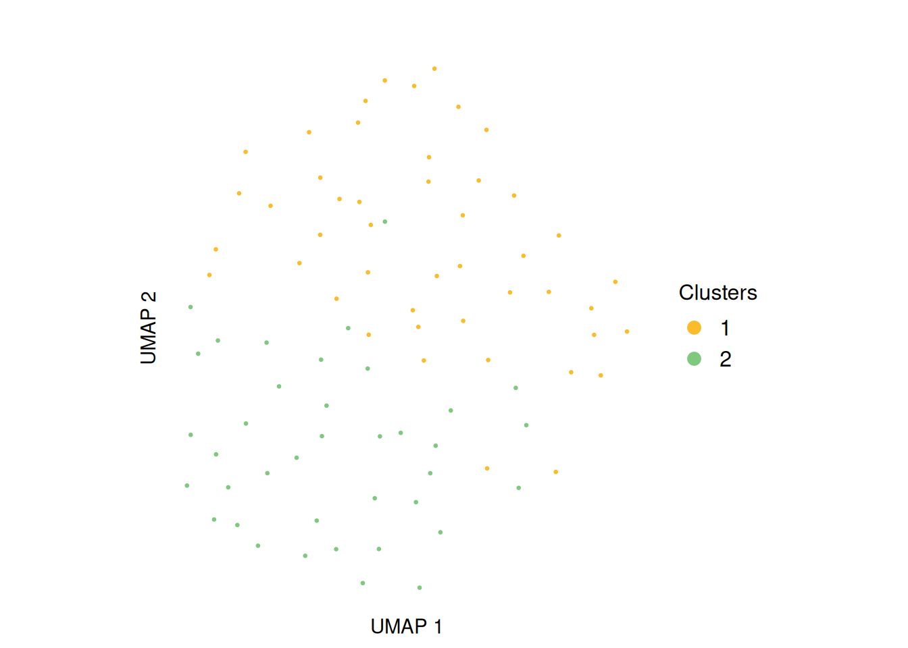

# Introduction to muscadet

`muscadet` (**mu**ltiomics **s**ingle-cell **c**opy number
**a**lterations **det**ection) is an R package designed to identify
somatic copy number alterations (CNAs) in cancer cells using single-cell
multiomics data. The package supports analyses ranging from a single
omics layer to multiple omics measured on the same cells, and is
designed to accommodate partially missing-modality scenarios. `muscadet`
enables the identification of tumor subclones through multi-omic cell
clustering and provides downstream tools for CNA inference within a
unified and reproducible workflow.

## 1 Installation

The latest version of muscadet can be installed directly from GitHub:

``` r
library(devtools)
devtools::install_github("ICAGEN/muscadet")
```

## 2 Inputs and objects creation

> **Important note on example data**
>
> The example dataset included in `muscadet` is a toy dataset designed
> for demonstration purposes only. It is deliberately minimal and
> contains a reduced genomic representation (three chromosomes). Its
> sole purpose is to illustrate how to run the main functions and
> explore the package features. Because of this strong simplification,
> the results obtained from this dataset should not be interpreted as
> biologically meaningful or methodologically representative.

### 2.1 muscomic

The `muscomic` objects (see
[`?muscomic`](https://icagen.github.io/muscadet/reference/muscomic-class.md))
are the primary objects used throughout the muscadet workflow. Each
`muscomic` object represents a single omics layer and serves as the
basic building block for downstream multi-omic integration, clustering,
and copy-number analysis in muscadet. They are created using the
[`CreateMuscomicObject()`](https://icagen.github.io/muscadet/reference/CreateMuscomicObject.md)
function and encapsulate all information related to a single omics
modality. The function requires the following inputs:

- `type`: the type of omic modality, currently `"RNA"` and `"ATAC"` are
  supported. Other DNA-based modalities can be provided using the
  `"ATAC"` type.
- `mat_counts`: a raw count matrix with cells as rows and features as
  columns (see
  [`?exdata_mat_counts`](https://icagen.github.io/muscadet/reference/exdata_mat_counts.md)).
- `allele_counts`: a data frame of raw allele-specific counts (see
  [`?exdata_allele_counts`](https://icagen.github.io/muscadet/reference/exdata_allele_counts.md))
  *(optional, can be added later in the analysis workflow)*.
- `features`: a data frame containing genomic coordinates of features
  (see
  [`?exdata_features`](https://icagen.github.io/muscadet/reference/exdata_features.md)).

``` r
library(muscadet)

# Load example dataset inputs:
# Matrices of raw counts per features
data("exdata_mat_counts_atac_tumor", "exdata_mat_counts_rna_tumor")
# Table of raw counts per allele
data("exdata_allele_counts_atac_tumor", "exdata_allele_counts_rna_tumor")
# Table of feature coordinates
data("exdata_peaks", "exdata_genes")

# Create individual omic objects
atac <- CreateMuscomicObject(
    type = "ATAC",
    mat_counts = exdata_mat_counts_atac_tumor, 
    allele_counts = exdata_allele_counts_atac_tumor, 
    features = exdata_peaks)
rna <- CreateMuscomicObject(
    type = "RNA",
    mat_counts = exdata_mat_counts_rna_tumor,
    allele_counts = exdata_allele_counts_rna_tumor,
    features = exdata_genes)

atac
#> A muscomic object 
#>  type: ATAC 
#>  label: scATAC-seq 
#>  cells: 71 
#>  counts: 71 cells x 1200 features (peaks)
#>  logratio: None
#>  variant positions: 681

rna
#> A muscomic object 
#>  type: RNA 
#>  label: scRNA-seq 
#>  cells: 69 
#>  counts: 69 cells x 300 features (genes)
#>  logratio: None
#>  variant positions: 359
```

### 2.2 muscadet

The `muscadet` objects (see
[`?muscadet`](https://icagen.github.io/muscadet/reference/muscadet-class.md))
are higher-level containers that group one or more `muscomic` objects
together with additional metadata and analysis results. They are used to
store and manage the outputs of downstream steps, including clustering,
and CNA calling.

A `muscadet` object is created using the
[`CreateMuscadetObject()`](https://icagen.github.io/muscadet/reference/CreateMuscadetObject.md)
function, which takes as input a list of `muscomic` objects, optional
bulk coverage information (see
[`?exdata_bulk_lrr`](https://icagen.github.io/muscadet/reference/exdata_bulk_lrr.md)),
and the genome assembly to be used for the analysis.

``` r
# Table of coverage information (log ratio) from bulk data (i.e. WGS)
data("exdata_bulk_lrr")

# Create multiomic muscadet object
muscadet <- CreateMuscadetObject(
    omics = list(ATAC = atac, RNA = rna),
    bulk.lrr = exdata_bulk_lrr,
    bulk.label = "WGS",
    genome = "hg38")
muscadet
#> A muscadet object 
#>  2 omics: ATAC, RNA 
#>  types: ATAC, RNA 
#>  labels: scATAC-seq, scRNA-seq 
#>  cells: 71, 69 (common: 63, total: 77) 
#>  counts: 71 cells x 1200 features (peaks), 69 cells x 300 features (genes) 
#>  logratio: None
#>  
#>  variant positions: 681, 359 
#>  bulk data: WGS 
#>  clustering: None 
#>  CNA calling: None 
#>  genome: hg38
```

The reference cells data must be stored in its own `muscadet` object

``` r
data("exdata_mat_counts_atac_ref", "exdata_mat_counts_rna_ref")
data("exdata_allele_counts_atac_ref", "exdata_allele_counts_rna_ref")

atac_ref <- CreateMuscomicObject(
    type = "ATAC",
    mat_counts = exdata_mat_counts_atac_ref,
    allele_counts = exdata_allele_counts_atac_ref,
    features = exdata_peaks)
rna_ref <- CreateMuscomicObject(
    type = "RNA",
    mat_counts = exdata_mat_counts_rna_ref,
    allele_counts = exdata_allele_counts_rna_ref,
    features = exdata_genes)
muscadet_ref <- CreateMuscadetObject(
    omics = list(ATAC = atac_ref, RNA = rna_ref),
    genome = "hg38")
muscadet_ref
#> A muscadet object 
#>  2 omics: ATAC, RNA 
#>  types: ATAC, RNA 
#>  labels: scATAC-seq, scRNA-seq 
#>  cells: 95, 93 (common: 85, total: 103) 
#>  counts: 95 cells x 1200 features (peaks), 93 cells x 300 features (genes) 
#>  logratio: None
#>  
#>  variant positions: 681, 359 
#>  bulk data: None 
#>  clustering: None 
#>  CNA calling: None 
#>  genome: hg38
```

Examples of complete `muscadet` objects are included in the example
dataset of the package.

``` r
# Example of muscadet object
data("exdata_muscadet", "exdata_muscadet_ref")
exdata_muscadet
#> A muscadet object 
#>  2 omics: ATAC, RNA 
#>  types: ATAC, RNA 
#>  labels: scATAC-seq, scRNA-seq 
#>  cells: 71, 69 (common: 63, total: 77) 
#>  counts: 71 cells x 1200 features (peaks), 69 cells x 300 features (genes) 
#>  logratio: 71 cells x 213 features (windows of peaks), 69 cells x 212 features (genes) 
#>  variant positions: 681, 359 
#>  bulk data: WGS 
#>  clustering: partitions = 0.1, 0.3, 0.5 ; optimal partition = 0.5 
#>  CNA calling: 2 clusters ; 3 consensus segments including 0 CNA segments 
#>  genome: hg38
exdata_muscadet_ref
#> A muscadet object 
#>  2 omics: ATAC, RNA 
#>  types: ATAC, RNA 
#>  labels: scATAC-seq, scRNA-seq 
#>  cells: 95, 93 (common: 85, total: 103) 
#>  counts: 95 cells x 1200 features (peaks), 93 cells x 300 features (genes) 
#>  logratio: None
#>  
#>  variant positions: 681, 359 
#>  bulk data: None 
#>  clustering: None 
#>  CNA calling: None 
#>  genome: hg38
```

### 2.3 Methods

Several method functions are available to access data within
`muscadet`/`muscomic` objects.

``` r
library(SeuratObject) # Cells() and Features() methods imported from SeuratObject

# Cell names
Cells(exdata_muscadet) # list of cells, one element per omic
Cells(exdata_muscadet)$ATAC # element of the list
Cells(exdata_muscadet$ATAC) # cells for muscomic object
Reduce(union, Cells(exdata_muscadet)) # all cells
Reduce(intersect, Cells(exdata_muscadet)) # common cells

# Feature names
Features(exdata_muscadet) # list, one element per omic
Features(exdata_muscadet)$ATAC

# Matrix of raw counts
matCounts(exdata_muscadet) # list, one element per omic
matCounts(exdata_muscadet$ATAC)

# Matrix of log ratios
matLogRatio(exdata_muscadet) # list, one element per omic
matLogRatio(exdata_muscadet)$ATAC

# Table of feature coordinates
coordFeatures(exdata_muscadet) # list, one element per omic
coordFeatures(exdata_muscadet)$RNA
```

``` r
library(SeuratObject) # Cells() and Features() methods imported from SeuratObject

# number of cells in total
length(Reduce(union, Cells(exdata_muscadet)))
#> [1] 77
# number of common cells
length(Reduce(intersect, Cells(exdata_muscadet)))
#> [1] 63
# number of cells per omic
lapply(Cells(exdata_muscadet), length)
#> $ATAC
#> [1] 71
#> 
#> $RNA
#> [1] 69
# number of features per omic
lapply(Features(exdata_muscadet), length)
#> $ATAC
#> [1] 213
#> 
#> $RNA
#> [1] 212
```

## 3 Compute log ratios

Genome-wide coverage profiles are computed as log R ratio (LRR) matrices
using the
[`computeLogRatio()`](https://icagen.github.io/muscadet/reference/computeLogRatio.md)
function for each omics modality contained in the muscadet object. This
step transforms raw count data into normalized coverage profiles along
the genome, which are used for downstream clustering analysis.

``` r
# Compute log R ratios from scATAC-seq read counts
exdata_muscadet <- computeLogRatio(
    x = exdata_muscadet,
    reference = exdata_muscadet_ref,
    omic = "ATAC",
    method = "ATAC",
    minReads = 0.5, # low value for small example dataset
    minPeaks = 1) # low value for small example dataset

# Compute log R ratios from scRNA-seq read counts
exdata_muscadet <- computeLogRatio(
    x = exdata_muscadet,
    reference = exdata_muscadet_ref,
    omic = "RNA",
    method = "RNA",
    refReads = 2, # low value for small example dataset
    refMeanReads = 0.01) 
```

To customize or refine the feature filtering applied by
[`computeLogRatio()`](https://icagen.github.io/muscadet/reference/computeLogRatio.md),
users can inspect the data distributions and review the filter status of
individual features before proceeding with downstream analyses.

``` r
library(ggplot2)

ATAC_features <- coordFeatures(exdata_muscadet)$ATAC

ggplot(ATAC_features, aes(x = nPeaks, y = meanReads.ref, color = keep)) +
    geom_point() +
    geom_vline(xintercept = 1 , linetype = "dashed", color = "red") + # minPeaks threshold
    geom_hline(yintercept = 0.5, linetype = "dashed", color = "red") + # minReads threshold
    scale_y_log10() +
    labs(x = "Number of peaks (minPeaks)", y = "Mean of reads in reference cells (minReads)",
         title = "ATAC features (windows of peaks) filtered by thresholds") +
    theme_minimal()
#> Warning in scale_y_log10(): log-10 transformation introduced infinite values.
```


``` r

RNA_features <- coordFeatures(exdata_muscadet)$RNA

ggplot(RNA_features, aes(x = sumReads.ref, y = meanReads.ref, color = keep)) +
    geom_point() +
    geom_vline(xintercept = 2, linetype = "dashed", color = "red") + # refReads threshold
    geom_hline(yintercept = 0.01, linetype = "dashed", color = "red") + # refMeanReads threshold
    scale_x_log10() + scale_y_log10() +
    labs(x = "Sum of reads in reference cells (refReads)", y = "Mean of reads in reference cells (refMeanReads)",
         title = "RNA features (genes) filtered by thresholds") +
    theme_minimal()
#> Warning in scale_x_log10(): log-10 transformation introduced infinite values.
#> log-10 transformation introduced infinite values.
```


## 4 Multimodal integrated clustering

Cells are clustered based on their log ratio profiles using the
[`clusterMuscadet()`](https://icagen.github.io/muscadet/reference/clusterMuscadet.md)
function. Two clustering strategies are currently available:

- **`method = "seurat"`**: Graph-based clustering using the
  [`Seurat`](https://satijalab.org/seurat/) package. This approach
  constructs a nearest-neighbor graph from a weighted combination of
  multiple modalities, using selected principal components from each
  modality, followed by community detection to identify clusters (see
  [`cluster_seurat()`](https://icagen.github.io/muscadet/reference/cluster_seurat.md)).

- **`method = "hclust"`**: Multi-omic integration via Similarity Network
  Fusion (SNF), followed by hierarchical clustering of the fused
  similarity matrix to identify cell clusters (see
  [`cluster_hclust()`](https://icagen.github.io/muscadet/reference/cluster_hclust.md)).

``` r
# Set seed for clustering reproducibility
set.seed(123) 

# Perform clustering with "seurat" method
exdata_muscadet <- clusterMuscadet(
    x = exdata_muscadet,
    method = "seurat",
    res_range = c(0.1, 0.3, 0.5),
    dims_list = list(1:10, 1:10),
    knn_seurat = 10, # adapted to low number of cells in example data
    knn_range_seurat = 30 # adapted to low number of cells in example data
)
#> Clustering method: 'seurat'
#> Resolutions to compute: 0.1, 0.3, 0.5
#> Number of selected dimensions: 10, 10
#> Clustering algorithm selected: 4 (Leiden)
#> Performing PCA...
#> Finding neighbors and constructing graph...
#> Computing UMAP...
#> Finding clusters...
#> Imputing clusters...
#> Computing Silhouette scores...
#> Done.
```

``` r
# Set seed for clustering reproducibility
set.seed(123)

# Perform clustering with "hclust" method
exdata_muscadet2 <- clusterMuscadet(
  x = exdata_muscadet,
  k_range = 2:4,
  method = "hclust",
  dist_method = "euclidean",
  hclust_method = "ward.D",
  weights = c(1, 1),
  quiet = TRUE
)
```

``` r
# Number of cells per cluster per partition
lapply(exdata_muscadet$clustering$clusters, table)
#> $`0.1`
#> 
#>  1 
#> 77 
#> 
#> $`0.3`
#> 
#>  1  2 
#> 41 36 
#> 
#> $`0.5`
#> 
#>  1  2  3 
#> 34 30 13
```

## 5 Clustering visualization

The distribution of cells across clustering partitions at different
resolutions can be explored using
[`clustree()`](https://lazappi.github.io/clustree/reference/clustree.html).

``` r
library(clustree)
# Build clustree
partitions <- lapply(exdata_muscadet$clustering$clusters, as.data.frame)
partitions <- do.call(cbind, partitions)
colnames(partitions) <- paste0("res_", names(exdata_muscadet$clustering$clusters))
clustree(partitions, prefix = "res_")
```


Genome-wide coverage profiles, along with the identified clusters, can
be visualized as a heatmap with
[`heatmapMuscadet()`](https://icagen.github.io/muscadet/reference/heatmapMuscadet.md),
on a selected clustering partition stored in the `muscadet` object.

``` r
# Plot heatmap 
heatmapMuscadet(
    exdata_muscadet,
    filename = file.path("figures", "heatmap_res0.3.png"),
    partition = 0.3,
    title = "Example | res=0.3"
)
```

 Additionally, an
aggregated heatmap showing the average log ratio values per cluster can
be plotted to summarize copy-number patterns across subclonal
populations.

``` r
# Plot heatmap of log ratio averages per cluster
heatmapMuscadet(
    exdata_muscadet,
    filename = file.path("figures", "heatmap_res0.3_averages.png"),
    partition = 0.3,
    averages = TRUE,
    title = "Example | res=0.3 | Averages per cluster"
)
```


Figure 1: Heatmap of log ratios averages per cluster

To visualize the integrated genome-wide coverage profiles, the data can
be projected into a low-dimensional space using Uniform Manifold
Approximation and Projection (UMAP). This projection provides an
intuitive view of cell relationships, allowing users to explore
subclonal structure and similarity between cells based on their
multi-omic copy-number profiles.

``` r
plotUMAP(exdata_muscadet, partition = 0.3)
```



## 6 Clustering validation

To assess the quality of the clustering partitions, Silhouette scores
are computed and stored in the `muscadet` object. These scores can be
visualized using
[`plotSil()`](https://icagen.github.io/muscadet/reference/plotSil.md).
Additional clustering validation metrics are also available and can be
explored with
[`plotIndexes()`](https://icagen.github.io/muscadet/reference/plotIndexes.md).
Together, these tools help guide the selection of the most appropriate
clustering partition for downstream analyses.

``` r
# View stored silhouette average widths per partition
exdata_muscadet$clustering$silhouette$sil.w.avg
#> $`0.1`
#> NULL
#> 
#> $`0.3`
#> [1] 0.1706987
#> 
#> $`0.5`
#> [1] 0.2172253
```

``` r
# Silhouette plot for individual clustering partition
plotSil(exdata_muscadet, partition = 0.3)
```


Figure 2: Silhouette plot for a clustering partition

``` r
# Plot clustering indexes for every stored partitions

plotIndexes(exdata_muscadet)
```


Figure 3: Plot of Silhouette scores across partitions

## 7 CNA calling

Before calling CNAs, a clustering partition must be selected using
[`assignClusters()`](https://icagen.github.io/muscadet/reference/assignClusters.md).

``` r
exdata_muscadet <- assignClusters(exdata_muscadet, partition = 0.3)
```

``` r
table(exdata_muscadet$cnacalling$clusters)
#> 
#>  1  2 
#> 41 36
```

Next, use
[`aggregateCounts()`](https://icagen.github.io/muscadet/reference/aggregateCounts.md)
with both the sample (tumor cells) and reference (normal cells)
`muscadet` objects to combine counts per cluster across all omics.

``` r
# Aggregate counts per cluster from all omics from both sample and reference
exdata_muscadet <- aggregateCounts(exdata_muscadet, exdata_muscadet_ref)
#> Clusters used: 1 (41 cells), 2 (36 cells)
#> Allelic data processing...
#> Coverage data processing...
#> Combining allelic and coverage data...
```

Finally, run
[`cnaCalling()`](https://icagen.github.io/muscadet/reference/cnaCalling.md)
to infer CNA segments for each cluster.

``` r
exdata_muscadet <- cnaCalling(
    exdata_muscadet,
    depthmin.a.clusters = 3, # set low thresholds for example data
    depthmin.c.clusters = 5,
    depthmin.a.allcells = 3,
    depthmin.c.allcells = 5,
    depthmin.c.nor = 1
)
#> - Analysis per cluster -
#> Initial number of positions: 2455
#> Initial number of allelic positions: 1313
#> Initial number of coverage positions: 1142
#> Integrating omics...
#> Filtering allelic positions: tumor depth >= 3 reads
#> Filtering coverage positions: tumor depth >= 5 reads
#> Filtering coverage positions: normal depth >= 1 reads
#> Allelic positions kept: 126
#> Coverage positions kept: 438
#> Final number of positions: 564
#> Performing segmentation per cluster...
#> Finding diploid log R ratio on clusters...
#> Diploid log R ratio = -0.09
#> Computing cell fractions and copy numbers on clusters...
#> - Analysis on all cells -
#> Aggregating allelic counts of all cells...
#> Filtering allelic positions: tumor depth >= 3 reads
#> Allelic positions kept: 186
#> Aggregating coverage counts of all cells...
#> Filtering coverage positions: tumor depth >= 5 reads
#> Filtering coverage positions: normal depth >= 1 reads
#> Coverage positions kept: 315
#> Final number of positions: 501
#> Performing segmentation on all cells...
#> Computing cell fractions and copy numbers on all cells...
#> - Consensus segments accross clusters -
#> Finding consensus segments...
#> 3 consensus segments identified, 0 CNA segments identified
#> Done.
```

> **Note**
>
> The default minimum depth (`depthmin.[...]`) filters may not be
> suitable for all datasets. It is recommended to inspect your data and
> adjust these parameters accordingly.

> **Note**
>
> The `omics.coverage` parameter can be set to one or more specific
> omics types (e.g., `"ATAC"` or `"RNA"`). This allows the CNA calling
> procedure to prioritize coverage from the selected omics, which can be
> useful when the signal from other modalities is noisy or less
> reliable.

## 8 CNA profiles

The resulting CNA calls can be visualized using
[`plotProfile()`](https://icagen.github.io/muscadet/reference/plotProfile.md),
which generates a multi-panel profile per cluster summarizing:

- Coverage per feature: log ratios values of genes/peaks, segment
  medians and diploid log ratio (purple line). Deviations from 0
  indicate gains (positive) or losses (negative) in coverage.
- Allele data: log odds ratio values (log-odds of reference vs
  alternative allele counts) at variant position and segment medians.
  Deviation from 0 suggests allelic imbalance, used to distinguish LOH,
  copy-neutral LOH, or allele-specific CNAs.
- Copy number calls: total and minor copy numbers per segment.
- CNA status classification: gain, loss or copy-neutral LOH statuses per
  segment.
- Cellular fraction: proportion of cells estimated to harbor the CNA at
  each segment.

``` r
plotProfile(exdata_muscadet, data = "1", title = "Cluster 1 profile", point.cex = 0.8)
```


``` r
plotProfile(exdata_muscadet, data = "allcells", title = "Profile for all cells", point.cex = 0.8)
```


To view the complete CNA profile of the sample across clusters, use
[`plotCNA()`](https://icagen.github.io/muscadet/reference/plotCNA.md).

``` r
plotCNA(exdata_muscadet, cf.gradient = FALSE)
```


