This document illustrates a **complete analysis workflow**, provided as a **step-by-step tutorial**, using the `muscadet` package on **10x Genomics Multiome (scATAC-seq + scRNA-seq) single cell data** from multiple myeloma tumor cells, together with matched normal reference cells.

The goals of this tutorial are to:

- Construct a multi-omic `muscadet` object
- Compute genome-wide log R ratio (coverage) profiles for ATAC and RNA modalities
- Perform integrated clustering of cells based on copy-number-driven coverage signals
- Select a biologically meaningful clustering partition
- Call copy number alterations (CNAs) at the cluster level
- Visualize CNA profiles and relate them to ATAC- and RNA-based UMAP embeddings

---

# Data description

> **Note**
>
> The data used in this analysis are not publicly available; however, the example dataset included in the `muscadet` package can be used instead to test functionalities, in that case please refer to the [Get Started vignette](https://icagen.github.io/muscadet/articles/muscadet.html) for guidance.

The dataset used in this tutorial consists of:

- **Tumor cells** from a multiple myeloma sample profiled using 10x Genomics Multiome technology. Normal cells have already been removed from the tumor dataset prior to this analysis
- **Reference (normal) cells**, used to normalize coverage and compute log R ratio profiles. These reference cells originate from individuals distinct from the tumor sample
- **Count matrices** from both scATAC-seq and scRNA-seq modalities
- **Allele-specific counts** from both scATAC-seq and scRNA-seq modalities, required for downstream allele-specific CNA calling
- A bulk whole-genome sequencing (WGS) log R ratio profile, used as an external reference to validate single-cell coverage profiles


Load the `muscadet` package. Additionally, this tutorial uses the following packages: `clustree`, `dplyr`, and `ggplot2`.

``` r
library(muscadet)
library(clustree)
library(dplyr)
library(ggplot2)

set.seed(123)
```

---

# Input data

The following inputs are loaded:

- **Count matrices** (`mat_counts_*`) for ATAC and RNA, tumor and reference cells
- **Allele count tables** (`allele_counts_*`) for ATAC and RNA, tumor and reference cells
- **Genomic coordinates** of features: peaks for ATAC and genes for RNA
- Bulk WGS log R ratio (LRR) values *(optional)*

> **Note**
>
> For additional details on input formats and preprocessing steps, see the [Preparation of input data vignette](https://icagen.github.io/muscadet/articles/data-prep.html).


``` r
# Matrices of raw counts
mat_counts_atac_tumor <- readRDS(file.path(inputdir, "mat_counts_atac_tumor.Rds"))
mat_counts_rna_tumor <- readRDS(file.path(inputdir, "mat_counts_rna_tumor.Rds"))
mat_counts_atac_ref <- readRDS(file.path(inputdir, "mat_counts_atac_ref.Rds"))
mat_counts_rna_ref <- readRDS(file.path(inputdir, "mat_counts_rna_ref.Rds"))

# Data frames of allele-specific counts
allele_counts_atac_tumor <- readRDS(file.path(inputdir, "allele_counts_atac_tumor.Rds"))
allele_counts_rna_tumor <- readRDS(file.path(inputdir, "allele_counts_rna_tumor.Rds"))
allele_counts_atac_ref <- readRDS(file.path(inputdir, "allele_counts_atac_ref.Rds"))
allele_counts_rna_ref <- readRDS(file.path(inputdir, "allele_counts_rna_ref.Rds"))

# Genomic coordinates
peaks_coord <- read.delim(file.path(inputdir, "peaks_coord.tsv"))
genes_coord <- read.delim(file.path(inputdir, "genes_coord.tsv"))

# Coverage (log R ratio) from matched WGS data
wgs_lrr <- read.delim(file.path(inputdir, "wgs_lrr.tsv"))
```


``` r
# Inspect dimensions of count matrices
df <- data.frame(
    ATAC_tumor = dim(mat_counts_atac_tumor),
    RNA_tumor = dim(mat_counts_rna_tumor),
    ATAC_ref = dim(mat_counts_atac_ref),
    RNA_ref = dim(mat_counts_rna_ref)
)
kable(t(df), col.names = c("Cells", "Features"))
```


|           | Cells| Features|
|:----------|-----:|--------:|
|ATAC_tumor |  2484|   239968|
|RNA_tumor  |  2445|    21360|
|ATAC_ref   | 22175|   239968|
|RNA_ref    | 19526|    23394|


``` r
# Inspect number of unique variant positions and cells
df <- data.frame(
    ATAC_tumor = c(
        length(unique(allele_counts_atac_tumor$cell)),
        length(unique(allele_counts_atac_tumor$id))),
    RNA_tumor = c(
        length(unique(allele_counts_rna_tumor$cell)),
        length(unique(allele_counts_rna_tumor$id))),
    ATAC_ref = c(
        length(unique(allele_counts_atac_ref$cell)),
        length(unique(allele_counts_atac_ref$id))),
    RNA_ref = c(
        length(unique(allele_counts_rna_ref$cell)),
        length(unique(allele_counts_rna_ref$id)))
)
kable(t(df), col.names = c("Cells", "Variant positions"))
```


|           | Cells| Variant positions|
|:----------|-----:|-----------------:|
|ATAC_tumor |  2620|           1127639|
|RNA_tumor  |  2616|            127359|
|ATAC_ref   | 25865|           1380988|
|RNA_ref    | 25758|            220287|


``` r
# Inspect number of features
nrow(peaks_coord)
```

```
## [1] 239968
```

``` r
nrow(genes_coord)
```

```
## [1] 20018
```

---

# Creating muscadet objects

Each omic modality is first wrapped into a `muscomic` object, which stores:

- Raw counts matrices
- Genomic feature coordinates
- Optional allele counts

These modality-specific objects are then combined into a single `muscadet` object, which represents a multi-omic single-cell dataset and serves as the central container for all downstream analyses in muscadet.

Tumor and reference datasets are created **separately**.
Optional bulk WGS log R ratio data may be added to the tumor `muscadet` object, but are not required - and typically not included - for the reference object.


``` r
# Tumor cells
omic_atac <- CreateMuscomicObject(
    type = "ATAC",
    mat_counts = mat_counts_atac_tumor,
    allele_counts = allele_counts_atac_tumor,
    features = peaks_coord)

omic_rna <- CreateMuscomicObject(
    type = "RNA",
    mat_counts = mat_counts_rna_tumor,
    allele_counts = allele_counts_rna_tumor,
    features = genes_coord)

muscadet <- CreateMuscadetObject(
    omics = list(omic_atac, omic_rna),
    bulk.lrr = wgs_lrr,
    bulk.label = "WGS",
    genome = "hg38")

# Reference cells
omic_atac_ref <- CreateMuscomicObject(
    type = "ATAC",
    mat_counts = mat_counts_atac_ref,
    allele_counts = allele_counts_atac_ref,
    features = peaks_coord)

omic_rna_ref <- CreateMuscomicObject(
    type = "RNA",
    mat_counts = mat_counts_rna_ref,
    allele_counts = allele_counts_rna_ref,
    features = genes_coord)

muscadet_ref <- CreateMuscadetObject(
    omics = list(omic_atac_ref, omic_rna_ref),
    genome = "hg38")
```


> **Important**
>
> **Allele counts are optional for clustering, but required for downstream CNA calling**. They can be provided either at object creation or added later using the `addAlleleCounts()`. As a result, cells can be clustered even when allele count data are not yet available. This approach can be useful when clustering and exploratory analyses are performed first, and CNA calling is deferred to a later step.


``` r
# To add allele counts later in the analysis
muscadet <- addAlleleCounts(
    muscadet,
    list(allele_counts_atac_tumor, allele_counts_rna_tumor)
)
muscadet_ref <- addAlleleCounts(
    muscadet_ref,
    list(allele_counts_atac_ref, allele_counts_rna_ref)
)
```

---

The content of the `muscadet` objects can be seen:


``` r
# Inspect objects
muscadet
```

```
## A muscadet object 
##  2 omics: ATAC, RNA 
##  types: ATAC, RNA 
##  labels: scATAC-seq, scRNA-seq 
##  cells: 2484, 2445 (common: 2309, total: 2620) 
##  counts: 2484 cells x 239968 features (peaks), 2445 cells x 14872 features (genes) 
##  logratio: None
##  variant positions: 1127639, 127359 
##  bulk data: WGS 
##  clustering: None 
##  CNA calling: None 
##  genome: hg38
```

``` r
muscadet_ref
```

```
## A muscadet object 
##  2 omics: ATAC, RNA 
##  types: ATAC, RNA 
##  labels: scATAC-seq, scRNA-seq 
##  cells: 22175, 19526 (common: 15836, total: 25865) 
##  counts: 22175 cells x 239968 features (peaks), 19526 cells x 15585 features (genes) 
##  logratio: None
##  variant positions: 1380988, 220287 
##  bulk data: None 
##  clustering: None 
##  CNA calling: None 
##  genome: hg38
```

The `muscadet` class of objects contains 5 slots:

- `omics`: a list of muscomic objects, one per omic modality
- `bulk.data`: log R ratio data derived from matched bulk sequencing, when available
- `clustering`: storage of clustering results and associated metrics
- `cnacalling`: results of CNA calling
- `genome`: reference genome information used throughout the analysis


``` r
str(muscadet, 2)
```

```
## Formal class 'muscadet' [package "muscadet"] with 5 slots
##   ..@ omics     :List of 2
##   ..@ bulk.data :List of 2
##   ..@ clustering: list()
##   ..@ cnacalling: list()
##   ..@ genome    : chr "hg38"
```

To access information in `muscomic` and `muscadet` objects several functions can be used:


``` r
# Get feature coordinates data frame
coordFeatures(omic_atac)
coordFeatures(muscadet)$ATAC

# Get count matrices and log R ratio matrices
matCounts(muscadet)$ATAC
matLogRatio(muscadet)$ATAC

# Get name of cells and features
Cells(omic_atac)
Features(omic_atac)
Reduce(union, Cells(muscadet)) # all cells from ATAC and RNA omics
```

---

# Computing log R ratios

Genome-wide log R ratios are computed independently for each omic using `computeLogRatio()`.

Tumor coverage is normalized against reference cells, the result is a genome-ordered matrix where deviations from zero reflect copy-number gains or losses. These resulting log R ratio matrices are stored directly within the `muscadet` objects returned by the function.


``` r
# compute log R ratios for ATAC
muscadet <- computeLogRatio(
    x = muscadet,
    reference = muscadet_ref,
    omic = "ATAC",
    method = "ATAC"
)
# compute log R ratios for RNA
muscadet <- computeLogRatio(
    x = muscadet,
    reference = muscadet_ref,
    omic = "RNA",
    method = "RNA"
)

muscadet
```

```
## A muscadet object 
##  2 omics: ATAC, RNA 
##  types: ATAC, RNA 
##  labels: scATAC-seq, scRNA-seq 
##  cells: 2484, 2445 (common: 2309, total: 2620) 
##  counts: 2484 cells x 239968 features (peaks), 2445 cells x 14872 features (genes) 
##  logratio: 2484 cells x 1364 features (windows of peaks), 2445 cells x 11281 features (genes) 
##  variant positions: 1127639, 127359 
##  bulk data: WGS 
##  clustering: None 
##  CNA calling: None 
##  genome: hg38
```

ATAC and RNA are handled using modality-specific normalization strategies in `computeLogRatio()`, which calls for the `computeLogRatioATAC()` and `computeLogRatioRNA()` functions respectively.

> **Note**
>
> For the ATAC method, the feature name becomes "windows of peaks", corresponding to genomic windows derived from peaks, as counts are aggregated into bins along the genome according to the `windowSize` and `slidingSize` parameters.
>
> For the RNA method, log R ratio values are smoothed using a running mean over windows defined by the `genesPerWindow` parameter.


The default feature-filtering parameters for the ATAC workflow implemented in `computeLogRatioATAC()` are:

- A minimum read average per window in reference cells (`minReads`) set to 5
- A minimum number of peaks per window (`minPeaks`) set to 100


The default feature-filtering parameters for the RNA workflow implemented in `computeLogRatioRNA()` are:

- A minimum of reads in reference cells (`refReads`) set to 100
- A minimum of average reads per reference cell (`refMeanReads`) set to 0.01

> **Important**
>
> These default feature-filtering values are tailored to this dataset and may not be appropriate for other datasets.

To customize or refine the feature filtering applied by `computeLogRatio()`, users are encouraged to inspect the underlying data distributions and to examine the filtering status of individual features.


``` r
library(ggplot2)

ATAC_features <- coordFeatures(muscadet)$ATAC

ATAC_plot <- ggplot(ATAC_features, aes(x = nPeaks, y = meanReads.ref, color = keep)) +
    geom_point() +
    geom_vline(xintercept = 100 , linetype = "dashed", color = "red") + # minPeaks threshold
    geom_hline(yintercept = 5, linetype = "dashed", color = "red") + # minReads threshold
    scale_y_log10() +
    labs(x = "Number of peaks (minPeaks)", y = "Mean of reads in reference cells (minReads)",
         title = "ATAC features (windows of peaks) filtered by thresholds") +
    theme_minimal()
ggsave("figures/ATAC_features.png", ATAC_plot)

RNA_features <- coordFeatures(muscadet)$RNA

RNA_plot <- ggplot(RNA_features, aes(x = sumReads.ref, y = meanReads.ref, color = keep)) +
    geom_point() +
    geom_vline(xintercept = 100, linetype = "dashed", color = "red") + # refReads threshold
    geom_hline(yintercept = 0.01, linetype = "dashed", color = "red") + # refMeanReads threshold
    scale_x_log10() + scale_y_log10() +
    labs(x = "Sum of reads in reference cells (refReads)", y = "Mean of reads in reference cells (refMeanReads)",
         title = "RNA features (genes) filtered by thresholds") +
    theme_minimal()
ggsave("figures/RNA_features.png", RNA_plot)
```

{width=70% fig-align="center"}
{width=70% fig-align="center"}

---

# Multi-omic clustering

Cells are clustered based on their log R ratio profiles using the `clusterMuscadet()` function. Two clustering strategies are currently available:

* **`method = "seurat"`**: Graph-based clustering using the [`Seurat`](https://satijalab.org/seurat/) package. This approach constructs a nearest-neighbor graph from a weighted combination of multiple modalities (Weighted Nearest-Neighbor graph, WNN), using selected principal components from each modality, followed by community detection to identify clusters (see `cluster_seurat()`).

* **`method = "hclust"`**: Multi-omic integration via Similarity Network Fusion (SNF), followed by hierarchical clustering of the fused similarity matrix to identify cell clusters (see `cluster_hclust()`).

For these data, clustering is performed using the **Seurat-based approach** (the default method). This approach enables joint neighborhood construction while preserving omic-specific signal.

In this framework, each omic is first processed independently to obtain a low-dimensional representation that captures the dominant sources of variation in the data (copy-number–driven variation reflected in log R ratios). From these representations, k nearest neighbor graphs are constructed separately for each omic.

The omic-specific neighbor graphs are then integrated into a unified graph, which reflects shared cell–cell relationships across modalities while remaining robust to modality-specific noise or missing information. This integrated graph serves as the basis for clustering.

Clustering is performed using a graph-based community detection algorithm, and multiple clustering resolutions are explored simultaneously via the `res_range` argument. This allows the user to evaluate partitions at different levels of granularity without rerunning the entire clustering step.


The resulting cluster assignments are stored in the `muscadet` object as a named list, with one element per resolution (`muscadet$clustering$clusters`).

Printing clusters sizes tables at this stage is helpful to view the number of cells per cluster per partitions.


``` r
# Clustering
muscadet <- clusterMuscadet(
    muscadet,
    method = "seurat",
    res_range = c(0.1, 0.2, 0.3, 0.4, 0.5),
    dims_list = list(1:8, 1:8)
)

str(muscadet$clustering, 1)
```

```
## List of 9
##  $ params       :List of 9
##  $ pcs          :List of 2
##  $ nn           :Formal class 'Neighbor' [package "SeuratObject"] with 5 slots
##  $ graph        :Formal class 'Graph' [package "SeuratObject"] with 7 slots
##  $ dist         : num [1:2309, 1:2309] -0.182 0.818 0.818 0.818 0.818 ...
##   ..- attr(*, "dimnames")=List of 2
##  $ umap         : num [1:2309, 1:2] 0.43 0.702 -3.084 3.103 3.065 ...
##   ..- attr(*, "scaled:center")= num [1:2] 1.328 0.722
##   ..- attr(*, "dimnames")=List of 2
##  $ clusters     :List of 5
##  $ silhouette   :List of 3
##  $ partition.opt: chr "0.3"
```

``` r
lapply(muscadet$clustering$clusters, table)
```

```
## $`0.1`
## 
##    1    2    3 
## 1156  776  688 
## 
## $`0.2`
## 
##    1    2    3 
## 1156  780  684 
## 
## $`0.3`
## 
##    1    2    3    4    5 
## 1011  776  359  332  142 
## 
## $`0.4`
## 
##    1    2    3    4    5 
## 1009  780  355  332  144 
## 
## $`0.5`
## 
##    1    2    3    4    5 
## 1005  773  362  334  146
```

> **Important**
>
> When performing Seurat-based clustering, the `dims_list` parameter specifies which dimensions of the low-dimensional embeddings (PCA) are used for neighbor graph construction. Selecting an appropriate number of dimensions is important: too few may miss relevant biological variation, while too many can introduce noise. In practice, dimensions capturing the majority of variance in the data are used, and this can be adjusted depending on dataset size and complexity.


``` r
# Extract variance info
get_variance_df <- function(pc_obj, label) {
    data.frame(
        PC = seq_along(pc_obj$importance["Proportion of Variance", ]),
        Proportion = pc_obj$importance["Proportion of Variance", ],
        Cumulative = pc_obj$importance["Cumulative Proportion", ],
        PCA = label
    )
}
df_atac <- get_variance_df(muscadet$clustering$pcs$ATAC, "ATAC")
df_rna <- get_variance_df(muscadet$clustering$pcs$RNA, "RNA")
combined_df <- rbind(df_atac, df_rna)

# Dimensions used for this dataset
dims_list <- list(1:8, 1:8)
thresholds <- data.frame(
    PC = c(max(dims_list[[1]]), max(dims_list[[2]])),
    PCA = names(muscadet$omics)
)

# Plot 20 first PCs
PCs_plot <- ggplot(dplyr::filter(combined_df, PC <= 20), aes(x = PC, fill = PCA)) +
    geom_col(aes(y = Proportion), position = "dodge", width = 0.7, alpha = 0.7) +
    geom_line(aes(y = Cumulative, color = PCA, group = PCA), linewidth = 1) +
    geom_point(aes(y = Cumulative, color = PCA, group = PCA)) +
    scale_y_continuous(
        labels = function(x) paste0(round(100 * x), "%"),
        expand = expansion(mult = c(0, 0.05))
    ) +
    labs(
        title = "Variance Explained by Principal Components",
        x = "Principal Component",
        y = "Variance Explained"
    ) +
    theme_minimal() +
    theme(legend.position = "top") +
    geom_vline(
        data = thresholds,
        aes(xintercept = PC, color = PCA),
        linetype = "dashed",
        show.legend = FALSE
    )
ggsave("figures/PCs_variance.png", PCs_plot)
```

{width=70% fig-align="center"}

---

# Exploring clustering partitions

## Clustering stability with clustree

To explore how clustering structure evolves across resolutions, we use the `clustree()` visualization provided by the [`clustree`](https://lazappi.github.io/clustree/index.html) package. This representation summarizes the relationships between clustering partitions by tracking how clusters split, merge, or persist as the resolution parameter increases.

In a clustree plot, nodes represent clusters at a given resolution, while edges indicate how cells are redistributed between clusters when moving to a higher resolution. This makes it possible to visually assess the stability of cluster assignments across resolutions.

This step helps to:

- Detect resolutions that are overly granular, characterized by excessive fragmentation or the appearance of very small clusters
- Identify stable cluster structures that persist across multiple consecutive resolutions, suggesting robust biological signal
- Select a resolution that provides an appropriate balance between interpretability and biological relevance


``` r
# Clustering visualization - clustree
library(clustree)
library(dplyr)

# Extract common cells across omics
# (clustering is performed on cells common to all omic modalities,
# cells missing one modality are imputed afterward and included in the output)
common_cells <- sort(Reduce(intersect, Cells(muscadet)))

# Construct clustree input
partitions <- muscadet$clustering$clusters %>%
  dplyr::bind_rows(.id = "res") %>%
  dplyr::select(common_cells) %>%
  t()
colnames(partitions) <- paste0("res_", names(muscadet$clustering$clusters))

# Plot clustering tree
clustree_plot <- clustree(partitions, prefix = "res_", node_label = "size") +
    guides(size = "none")
ggsave("figures/clustree.png", clustree_plot)
```

{width=80% fig-align="center"}

## UMAP visualization

UMAP embeddings provide an intuitive two-dimensional representation of the clustering space. They are particularly useful for visualizing overall cell relationships and the relative positioning of clusters.

It is important to note that UMAP is used solely for visualization: clusters are defined in the original high-dimensional space, and UMAP does not influence the clustering itself.

Concordance between UMAP separation and observed CNA patterns can be reassuring and help validate cluster assignments, but discrepancies do not necessarily indicate problems, as some biologically meaningful structure may not be fully captured in two dimensions.


``` r
# clustering visualization - silhouette widths
for (p in names(muscadet$clustering$clusters)) {

    filename <- file.path("figures", paste0("UMAP_res_", p, ".png"))
    title <- paste(
        paste0("method=", muscadet$clustering$params[["method"]]), "|",
        paste0("omics=", paste0(muscadet$clustering$params[["omics"]], collapse = ",")), "|",
        paste0("dims=", "8-8"), "|",
        paste0("res=", p)
    )

    plotUMAP(muscadet, partition = p, title = title)
    ggsave(filename)
}
```

{width=60% fig-align="center"}

{width=60% fig-align="center"}

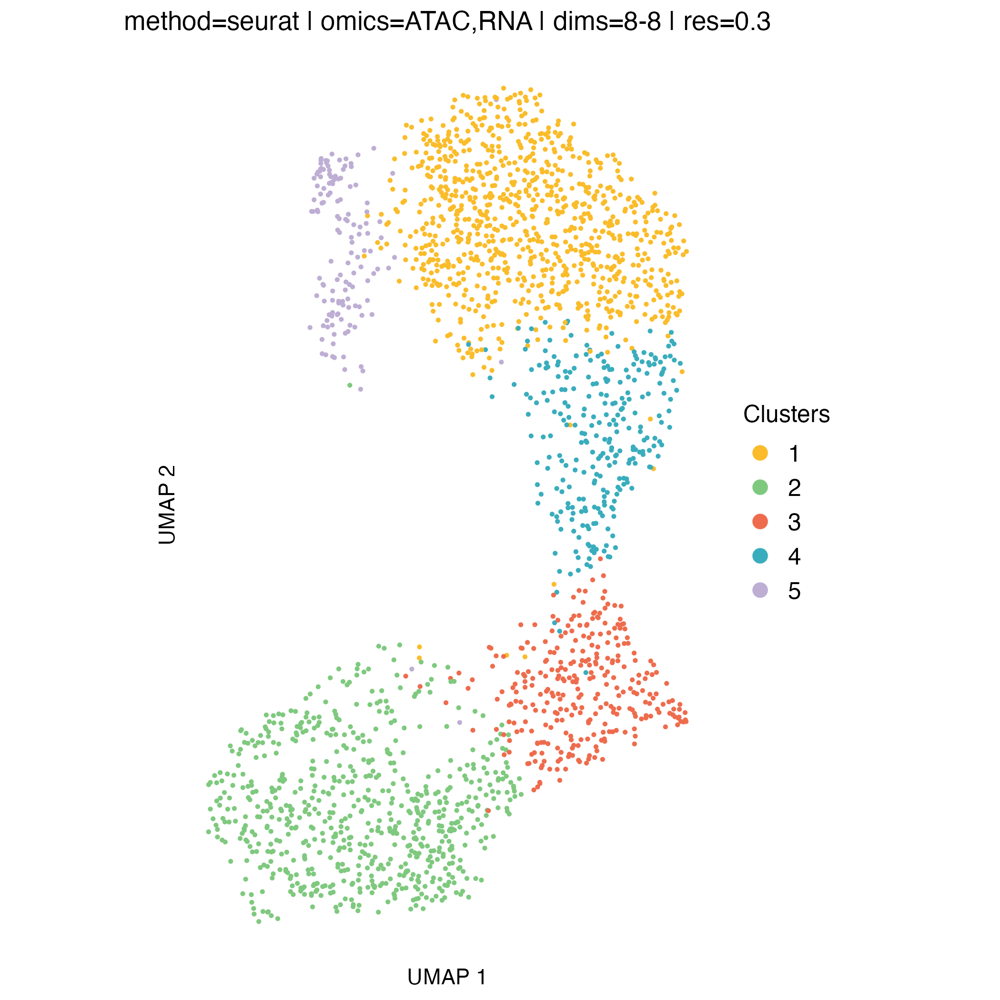{width=60% fig-align="center"}

{width=60% fig-align="center"}

{width=60% fig-align="center"}

## Genome-wide heatmaps of coverage profiles

Genome-wide heatmaps provide a direct and intuitive visualization of copy-number–driven signal across single cells and cell populations. In `muscadet`, genome-wide coverage or log R ratio profiles can be visualized as heatmaps using the `heatmapMuscadet()` function, based on a selected clustering partition stored in the `muscadet` object.

At the single-cell level, heatmaps display genome-wide log R ratio profiles for individual cells, ordered by their cluster assignments. This representation makes it possible to assess both intra-cluster homogeneity and inter-cluster differences in copy-number profiles.

In addition, `muscadet` allows the visualization of aggregated heatmaps, in which log R ratio values are averaged across cells within each cluster. These cluster-level summaries provide an overview of recurrent copy-number alteration (CNA) patterns and can facilitate the comparison of subclonal populations.

Together, these visualizations provide two complementary perspectives:

- Single-cell heatmaps, ordered by clusters, which highlight cell-to-cell variability and cluster coherence
- Cluster-average heatmaps, which summarize dominant CNA patterns and emphasize subclonal structure

When interpreting genome-wide heatmaps, the following points are particularly informative:

- Vertical shifts spanning contiguous genomic regions typically reflect chromosome-scale or arm-level copy number gains or losses
- Consistent log R ratio patterns across cells within the same cluster support the biological relevance and robustness of the inferred clusters

These heatmaps are therefore a key visualization step for validating clustering results and for guiding downstream pseudo-bulk aggregation and CNA calling.

> **Note**
>
> Large figures in this tutorial, such as heatmaps, are generated at lower resolution by default to reduce storage requirements;
> users may increase the resolution (or simply omit the argument to use the default value) if higher-quality output is desired.


``` r
# clustering visualization - genome-wide coverage heatmaps
for (p in names(muscadet$clustering$clusters)) {

    filename <- file.path("figures", paste0("heatmap_res_", p, ".png"))
    title <- paste(
        paste0("method=", muscadet$clustering$params[["method"]]), "|",
        paste0("omics=", paste0(muscadet$clustering$params[["omics"]], collapse = ",")), "|",
        paste0("dims=", "8-8"), "|",
        paste0("res=", p)
    )

    heatmapMuscadet(muscadet,
                    filename,
                    partition = p,
                    title = title,
                    show_missing = TRUE,
                    png_res = 100)
}
```

{width=100% fig-align="center"}

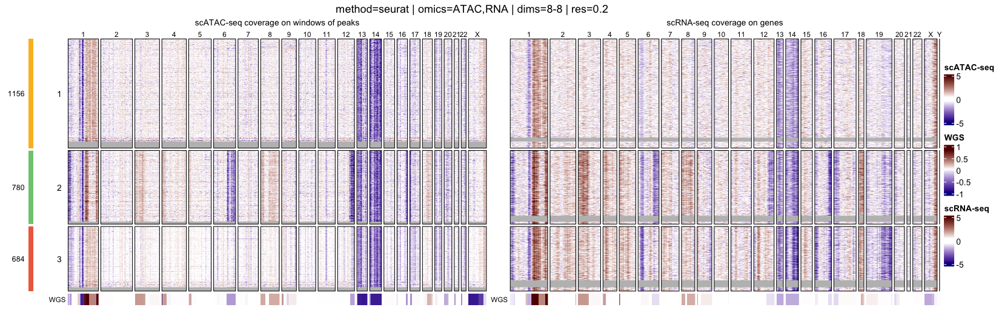{width=100% fig-align="center"}

{width=100% fig-align="center"}

{width=100% fig-align="center"}

{#fig-ht width=100% fig-align="center"}


``` r
for (p in names(muscadet$clustering$clusters)) {

    filename <- file.path("figures", paste0("heatmap_res_", p, "_av.png"))
    title <- paste(
        paste0("method=", muscadet$clustering$params[["method"]]), "|",
        paste0("omics=", paste0(muscadet$clustering$params[["omics"]], collapse = ",")), "|",
        paste0("dims=", "8-8"), "|",
        paste0("res=", p),
        "| Averages per cluster"
    )

    heatmapMuscadet(
        muscadet,
        filename,
        partition = p,
        title = title,
        averages = TRUE)
}
```

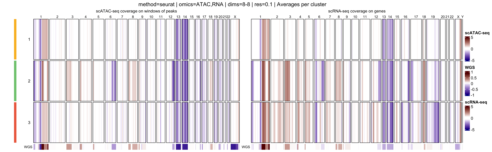{width=100% fig-align="center"}

{width=100% fig-align="center"}

{width=100% fig-align="center"}

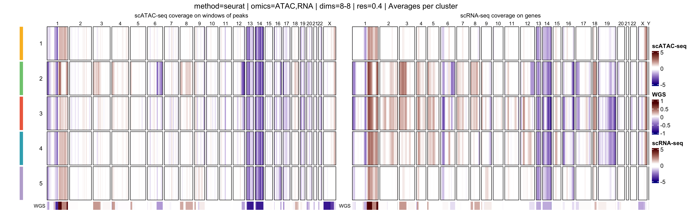{width=100% fig-align="center"}

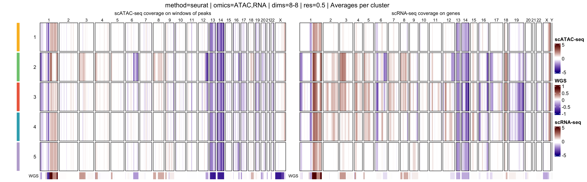{width=100% fig-align="center"}


## Clustering quality metrics

Silhouette widths are computed automatically during the clustering step and stored within the `muscadet object`. These scores can be visualized using the `plotSil()` function.

Silhouette values measure how similar a cell is to its assigned cluster compared to neighboring clusters. Higher values indicate better-defined and more clearly separated clusters, whereas low or negative values suggest ambiguous assignments or overlapping cluster structure.

When using silhouette widths in practice:

- Higher silhouette values generally indicate improved cluster separation
- Distributions of silhouette scores should be compared across clustering resolutions, rather than interpreted in absolute terms for a single partition

Importantly, silhouette-based metrics are intended to complement, not replace, biological inspection of genome-wide heatmaps and copy number patterns. In the context of CNA-driven clustering, biological coherence and interpretability remain the primary criteria for selecting an appropriate resolution.

> **Note**
>
> In addition, the `plotIndexes()` function can be used to compute and visualize complementary clustering validation indices.


``` r
# clustering visualization - silhouette widths
for (p in names(muscadet$clustering$clusters)) {

    filename <- file.path("figures", paste0("plotSil_res_", p, ".png"))
    title <- paste(
        paste0("method=", muscadet$clustering$params[["method"]]), "|",
        paste0("omics=", paste0(muscadet$clustering$params[["omics"]], collapse = ",")), "|",
        paste0("dims=", "8-8"), "|",
        paste0("res=", p)
    )

    plotSil(muscadet, partition = p, title = title)
    ggsave(filename)
}
```

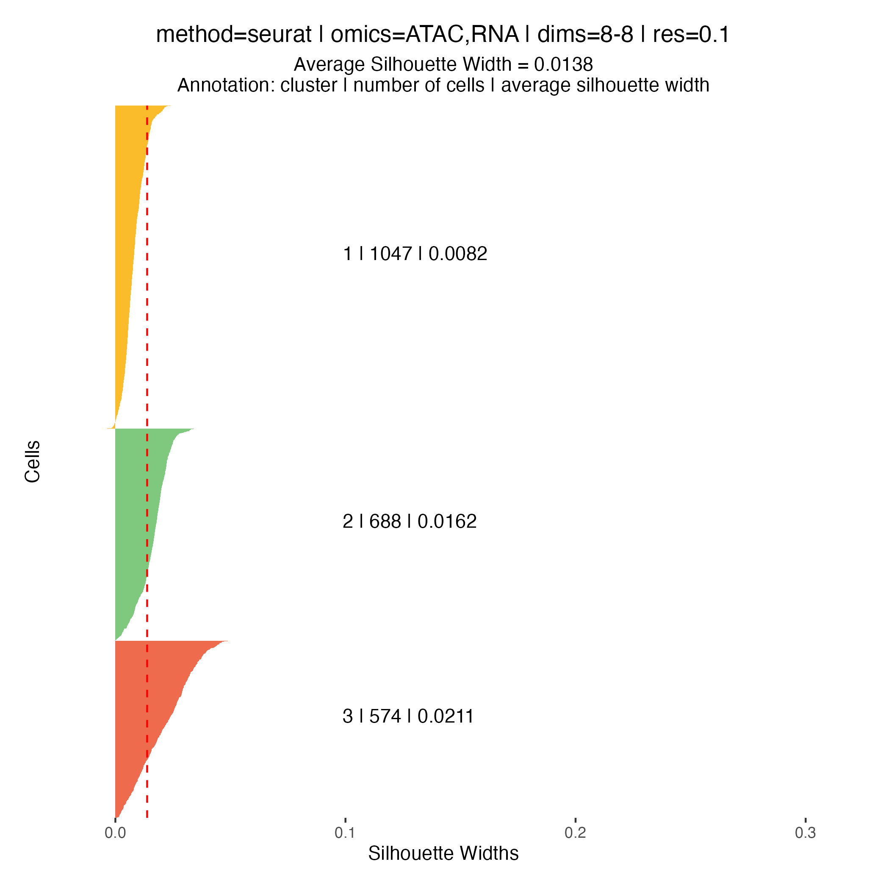{width=70% fig-align="center"}

{width=70% fig-align="center"}

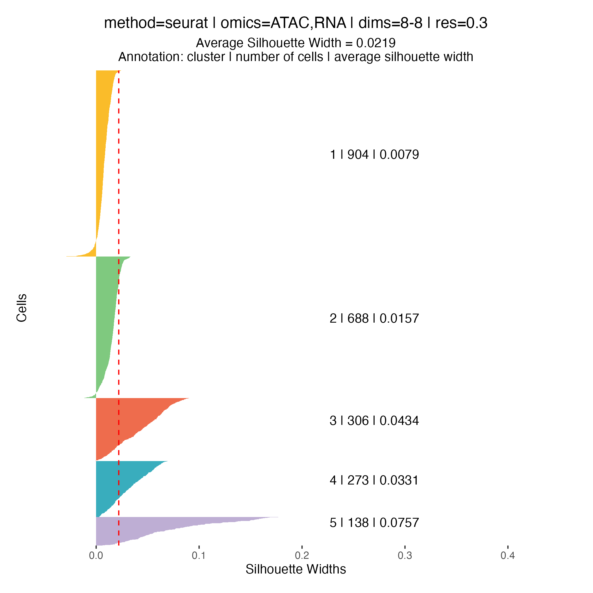{width=70% fig-align="center"}

{width=70% fig-align="center"}

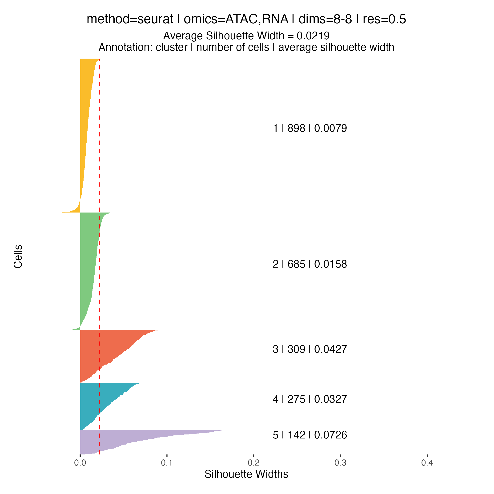{width=70% fig-align="center"}

---

# CNA calling

## Selecting a clustering partition

Before performing copy number calling, a single clustering partition must be selected using `assignClusters()`. This partition defines which cells are aggregated into pseudo-bulk profiles for downstream analysis.

> **Note**
>
> In this tutorial, we select the partition at resolution `0.2`, which yields three clusters.
>
> At higher resolutions, additional clusters appear: for example, cluster 5 in the resolution `0.3` partition corresponds to a subpopulation with a deletion on chromosome 16q (visible in the scATAC-seq profile) however, this subpopulation represents less than 6% of cells, and for clarity and interpretability, it is not included in downstream analysis for this tutorial.


``` r
# Assign the chosen clustering partition
muscadet <- assignClusters(muscadet, partition = 0.2)
table(muscadet$cnacalling$clusters)
```

```
## 
##    1    2    3 
## 1156  780  684
```

{width=100% fig-align="center"}

## Aggregating counts

The `aggregateCounts()` function combines counts across all cells within each cluster and across multiple omics. This produces pseudo-bulk profiles that are suitable for segmentation and downstream copy number inference.

This step is mandatory for CNA calling. Aggregation is required to produce sufficiently robust signal as it improves signal-to-noise ratio: by combining single-cell measurements, random fluctuations are reduced, making copy number patterns more apparent.

Reference counts are aggregated similarly across all cells and omics to remain consistent and comparable.


``` r
# Merge all counts from all omics from both sample and reference
muscadet <- aggregateCounts(muscadet, muscadet_ref)
```

## Running CNA calling

CNA calling is performed using the `cnaCalling()` function, which segments pseudo-bulk profiles and infers copy number alterations. This function integrates coverage and allelic data to segment chromosomes and to produce cluster-level copy number calls.

> **Note**
>
> In this dataset, ATAC-derived coverage profiles exhibit cleaner signal than RNA-derived profiles. To avoid introducing noise in that case, CNA calling is restricted to ATAC coverage by setting `omics.coverage = "ATAC"`.

Note that this selection applies only to coverage data; allelic information can still be used from multiple omics. Coverage from multiple omics can be used if both are reliable and comparable.

> **Important**
>
> During CNA calling, a series of filters based on minimum value thresholds (`depthmin.*.*`) are applied to remove noise. The default thresholds are tailored to this dataset, but they may need to be adjusted for other datasets with different characteristics or sequencing depth.


``` r
# CNA calling
muscadet <- cnaCalling(muscadet, omics.coverage = "ATAC")
```


The output is stored within the `muscadet` object and includes:

- Positions (`positions` / `positions.allcells`): base-level data for each genomic position (coverage/allele counts, log-R ratio, variant allele frequency, and cluster assignment)
- Segments (`segments` / `segments.allcells`): aggregated contiguous positions forming segments and associated data (median log-R ratio, median variant allele frequency, copy number estimates, and cluster assignment)
- Consensus segments (`consensus.segs`): unique segments across clusters (segment coordinates, CNA status, and clonal CNA status)
- Cluster-level summary table (`table`): consensus segments annotated per cluster (segment coordinates, cluster assignment, copy numbers, CNA state (gain/neutral/loss), proportion of cells of cluster, proportion of total cells, ...)


## CNA profile visualization


Per-cluster CNA profiles provide a detailed view of copy number alterations within each subpopulation:

- Genome-wide coverage, each dot represents a feature, showing log R ratio values
- Allele-specific imbalance, each dot represents a heterozygous variant, highlighting allelic deviations
- Chromosome separation
- Segmentation of the genome based on the coverage and allele signals
- Estimated total and minor copy numbers inferred for each segment

In addition to per-cluster profiles, plotting all cells together can provide a global overview but should not replace cluster-level interpretation.


``` r
# Per cluster
for (i in unique(muscadet$cnacalling$clusters)) {

    filename <- file.path("figures", paste0("CNAprofile_", i, ".png"))

    png(filename, width = 15, height = 7.5, units = "in", res = 150)
    plotProfile(muscadet, data = i, title = paste("Cluster:", i))
    dev.off()
}

# All cells
filename <- file.path("figures", paste0("CNAprofile_allcells.png"))
png(filename, width = 15, height = 7.5, units = "in", res = 150)
plotProfile(muscadet, data = "allcells", title = "All cells")
dev.off()
```

```
## quartz_off_screen 
##                 2
```

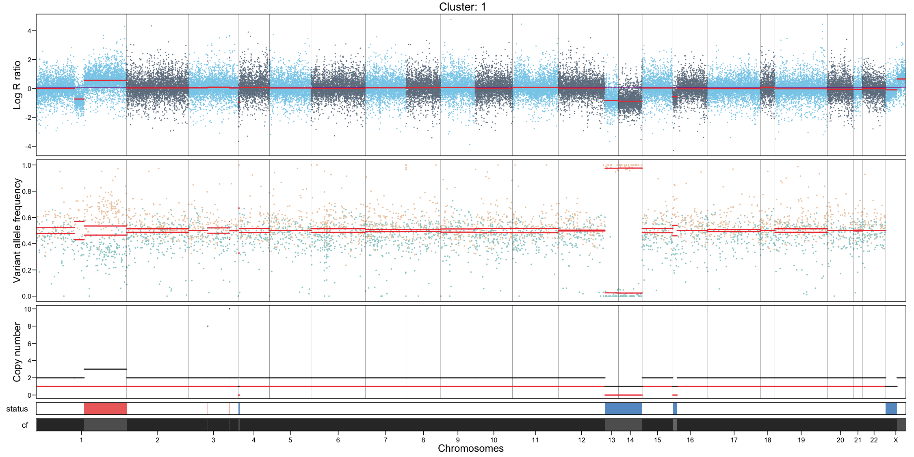{width=100% fig-align="center"}

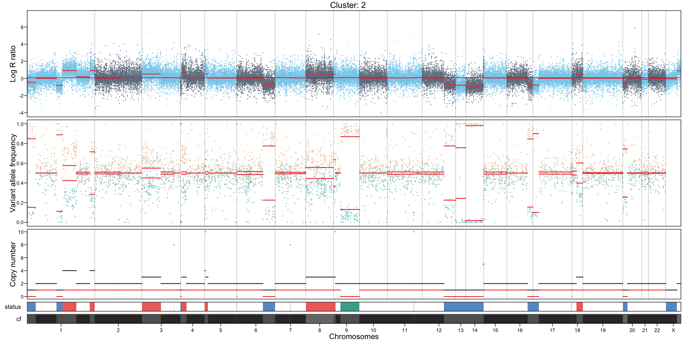{width=100% fig-align="center"}

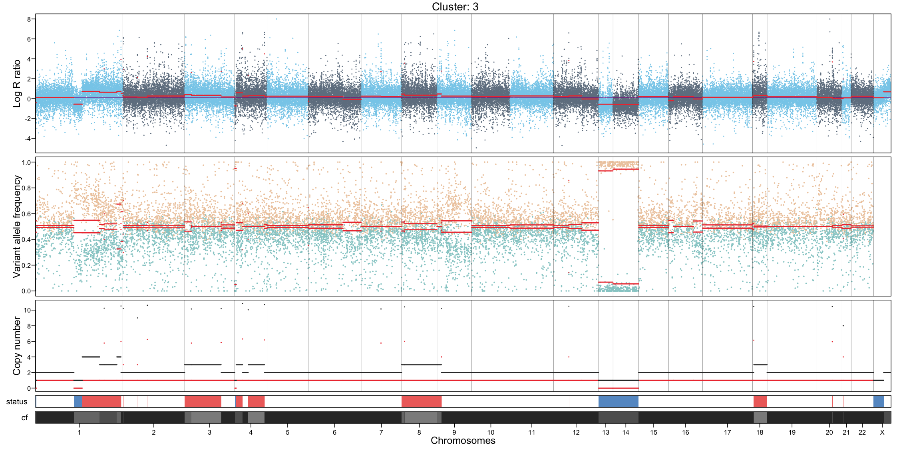{width=100% fig-align="center"}

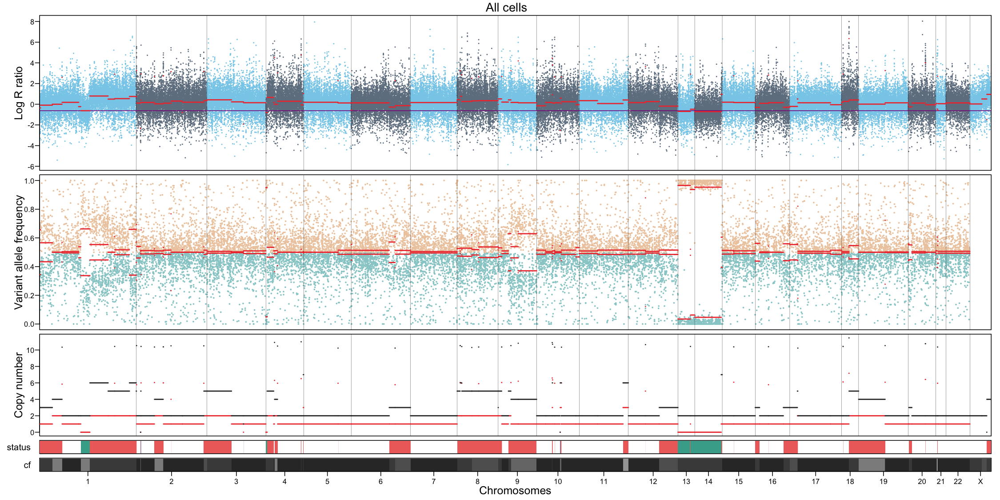{width=100% fig-align="center"}

---

Additionnally, a complete CNA profile of all clusters at the sample-level can be visualize using `plotCNA()`.


``` r
CNAplot <- plotCNA(muscadet, cf.gradient = FALSE)
ggsave("figures/CNAplot.png", CNAplot, width = 7, height = 4, units = "in")
```

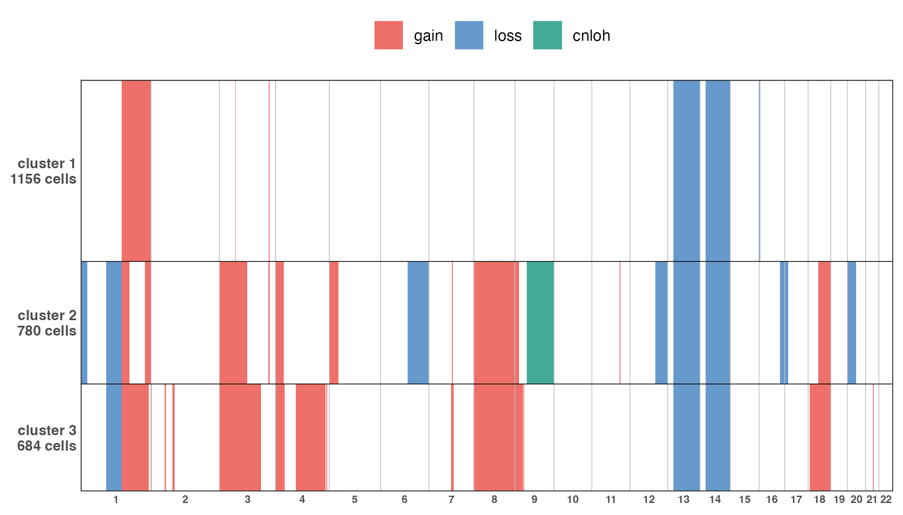{width=100% fig-align="center"}

## Integrating CNA clusters with ATAC/RNA embeddings

After CNA calling, CNA-defined clusters can be projected onto independent ATAC- and RNA-based UMAP embeddings. This visualization helps to explore the relationship between genomic alterations and cellular phenotypes.

This step illustrates:

- How CNA-defined subclones relate to transcriptional and chromatin states
- Whether CNA structure aligns with modality-specific embeddings
- Potential decoupling between copy-number variation and expression

This projection provides a complementary perspective to cluster-level CNA analysis, integrating genomic and functional information in a single visualization.


``` r
library(ggplot2)

# import UMAP coordinates based on chromatin accessibility and expression
UMAP_coord_atac <- read.delim(file.path(inputdir, "UMAP_coord_atac.tsv"))
UMAP_coord_rna <- read.delim(file.path(inputdir, "UMAP_coord_rna.tsv"))

# add cluster assignments to coordinates tables
clusters <- muscadet$cnacalling$clusters
UMAP_coord_atac$cluster <- factor(clusters[match(UMAP_coord_atac$cell, names(clusters))])
UMAP_coord_rna$cluster <- factor(clusters[match(UMAP_coord_rna$cell, names(clusters))])

palette_clusters <- c("#FABC2A", "#7FC97F", "#EE6C4D")

UMAP_atac <- ggplot(UMAP_coord_atac, aes(x = UMAP_1 , y = UMAP_2, color = cluster)) +
    geom_point(size = 1.2) +
    scale_color_manual(name = "", values = setNames(palette_clusters, sort(unique(
    UMAP_coord_atac$cluster
    )))) +
    labs(title = "scATAC-seq") +
    xlab("UMAP 1") +
    ylab("UMAP 2") +
    coord_fixed() +
    guides(colour = guide_legend(override.aes = list(size = 3))) +
    theme_bw() +
    theme(
        panel.grid = element_blank(),
        panel.border = element_blank(),
        axis.text = element_blank(),
        axis.ticks = element_blank(),
    )
ggsave("figures/UMAP_atac.png", UMAP_atac)

UMAP_rna <- ggplot(UMAP_coord_rna, aes(x = UMAP_1 , y = UMAP_2, color = cluster)) +
    geom_point(size = 1.2) +
    scale_color_manual(name = "", values = setNames(palette_clusters, sort(unique(
        UMAP_coord_rna$cluster
    )))) +
    labs(title = "scRNA-seq") +
    xlab("UMAP 1") +
    ylab("UMAP 2") +
    coord_fixed() +
    guides(colour = guide_legend(override.aes = list(size = 3))) +
    theme_bw() +
    theme(
        panel.grid = element_blank(),
        panel.border = element_blank(),
        axis.text = element_blank(),
        axis.ticks = element_blank()
    )
ggsave("figures/UMAP_rna.png", UMAP_rna)
```

{width=60% fig-align="center"}
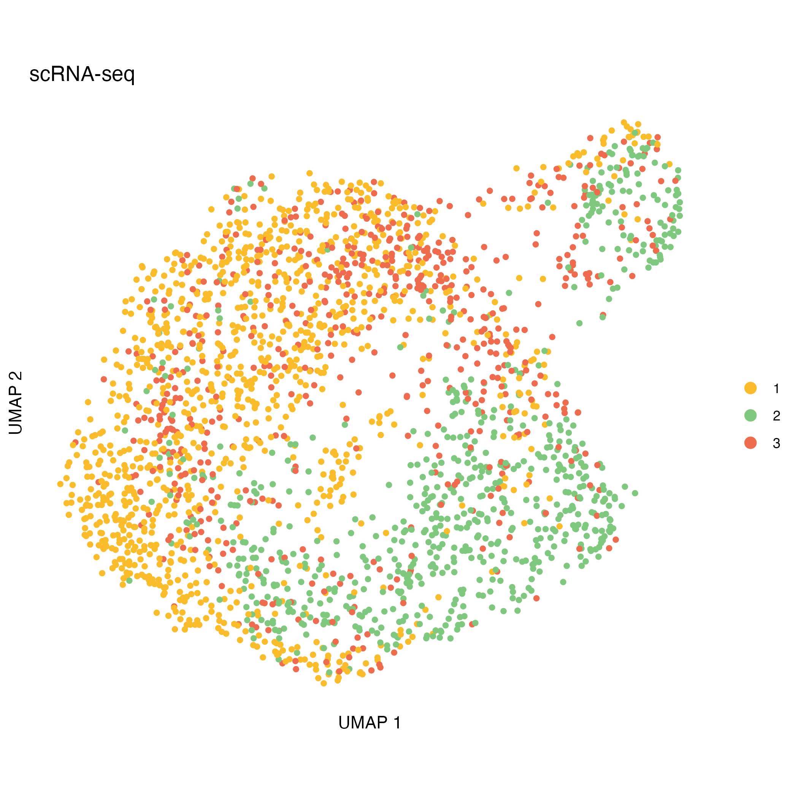{width=60% fig-align="center"}

---

# Key parameters to tune


| **Step**                | **Parameter**                                                            | **Argument**                                                    | **Notes**                                                                     |
| ----------------------- | ------------------------------------------------------------------------ | --------------------------------------------------------------- | -------------------------------------------------------------------------------------- |
| **Compute log R ratio** | Feature filters: remove low-quality or poorly covered features           | `minReads`, `minPeaks` (ATAC); `refReads`, `refMeanReads` (RNA) | Adjust depending on dataset coverage                                                   |
|                         | Window/smoothing: define size of genomic windows                         | `windowSize`, `slidingSize` (ATAC); `genesPerWindow` (RNA) | Choose based on desired resolution of CNAs                                             |
| **Clustering**          | Range for partitions: explore multiple resolutions or cluster numbers    | `res_range` (Seurat-based); `k_range` (hclust)                  | Select based on cluster stability and biological interpretability                      |
|                         | Selected dimensions from low-dimensional embeddings (Seurat-based only)  | `dims_list` (Seurat-based)                                      | Choose top dimensions capturing most variance; adjust for noise and dataset complexity |
| **CNA calling**         | Omic selection for coverage: use the most reliable omic to reduce noise  | `omics.coverage`                                                | `"ATAC"` or `"RNA"`; multiple omics can be used if both are reliable                   |
|                         | Feature/position filters: remove poorly covered positions or variants    | `depthmin.*.*`                                                  | Adjust depending on sequencing depth and data quality                                  |


